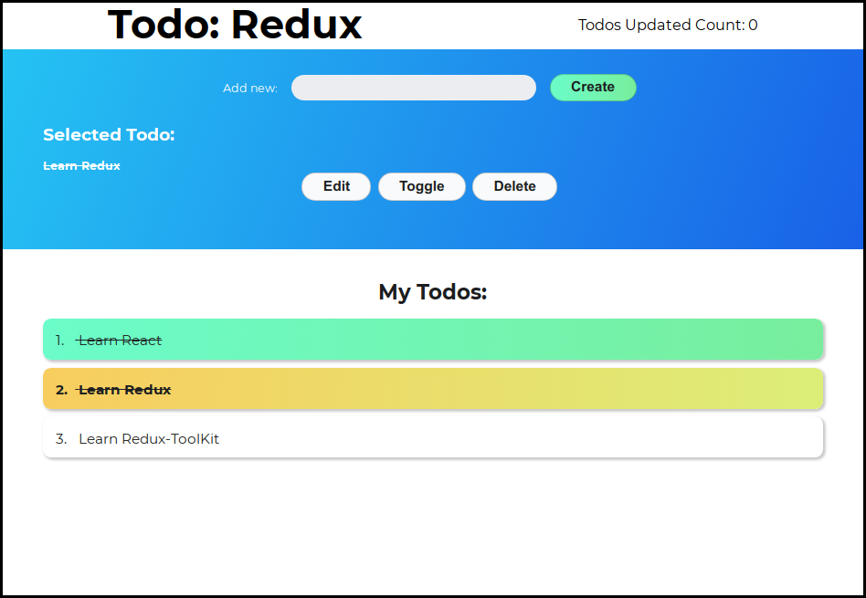

# Todo app built with redux.

Inspired by [angle943's redux-toolkit todo app](https://github.com/angle943/redux-toolkit-comparison)

To use this for practice, switch to the ##starter## branch and run `yarn start` or `npm start` if that's what you use
